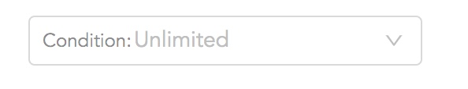
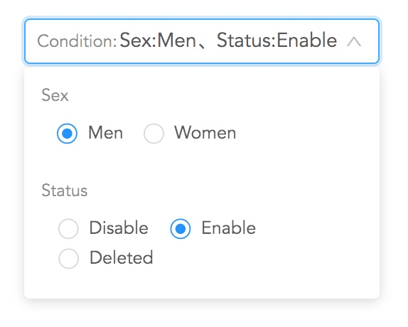

# ant-vue-condition-filter
[![MIT License][license-image]][license-url]
[![FOSSA Status][fossa-badge-image]][fossa-badge-url]

本项目为组件库示例样板。

使用示例清参看 [demo][url1]

开发示例请参看 [Development-ChineseSimplified.md][url2]

# 示例

## License
[MIT license][license-url]

[![FOSSA Status][fossa-large-image]][fossa-large-url]

[url1]:./demo/
[url2]:Development-ChineseSimplified.md

[license-image]: https://img.shields.io/badge/license-MIT-blue.svg?style=flat
[license-url]: LICENSE

[fossa-badge-image]: https://app.fossa.com/api/projects/git%2Bgithub.com%2Funlangchan%2Fant-vue-condition-filter.svg?type=shield
[fossa-badge-url]: https://app.fossa.com/projects/git%2Bgithub.com%2Funlangchan%2Fant-vue-condition-filter?ref=badge_shield

[fossa-large-image]: https://app.fossa.com/api/projects/git%2Bgithub.com%2Funlangchan%2Fant-vue-condition-filter.svg?type=large
[fossa-large-url]: https://app.fossa.com/projects/git%2Bgithub.com%2Funlangchan%2Fant-vue-condition-filter?ref=badge_large